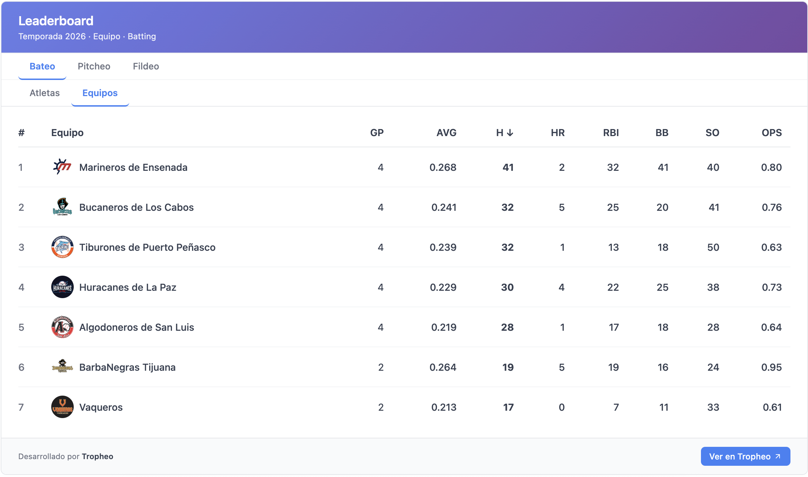
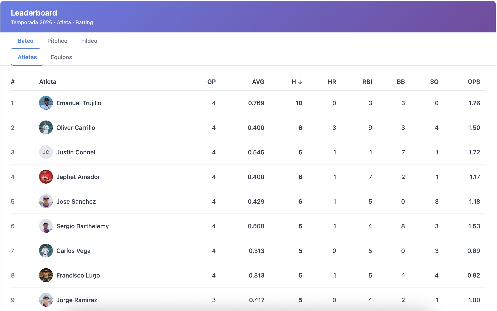

# Tropheo Widgets

A library for embedding Tropheo tournament standings and stats widgets into any website or application.

## 🚀 New to Tropheo Widgets?

**Start here:**

- 🇪🇸 [Guía Simple en Español](./SIMPLE_GUIDE.md) - Paso a paso para principiantes
- 🇺🇸 [Simple Guide in English](./SIMPLE_GUIDE_EN.md) - Step-by-step for beginners

**For developers:**

- [Quick Start Guide](./QUICK_START.md) - Get started in 5 minutes
- [Full Documentation](./docs/getting-started.md) - Complete integration guide

## Features

### 📊 Standings Widget

Displays team standings tables for any event structure — from a single pool or bracket all the way up to full seasons and leagues. The widget automatically detects the event type and loads the right data:

- **Pool / Bracket stage** — shows wins, losses, ties, runs/points scored, and standings position for the teams in that group.
- **Division** — loads all pools inside the division and shows a consolidated view.
- **Tournament** — renders a summary across all divisions and pools.
- **Season / League** — aggregates standings across every stage of the season, grouped by phase (e.g. "Primera Vuelta", "Segunda Vuelta").

On mobile it renders a hierarchical drill-down (season → division → pool). On desktop it shows all groups side-by-side.

<!-- Add a screenshot here once you have one:

-->

### 🏆 Leaderboard / Stats Widget

Shows a sortable statistics table for players or teams. Columns depend on the sport and the statistical facet you configure:

| Sport               | Available facets       | Example columns                         |
| ------------------- | ---------------------- | --------------------------------------- |
| Baseball / Softball | `baseball`, `pitching` | AVG, HR, RBI, OBP, ERA, WHIP, K, BB     |
| Basketball          | `basketball`           | PTS, REB, AST, STL, BLK, FG%            |
| Soccer              | `soccer`               | Goals, Assists, Yellow Cards, Red Cards |

Any column header is clickable to re-sort the table descending. Supports both `athletes` (individual player stats) and `teams` modes.




### Other highlights

- ⚛️ React components for React / Next.js apps
- 🌐 Vanilla JavaScript bundle for any website (zero runtime dependencies)
- 🔒 Secure API key authentication per organization
- 📱 Responsive — adapts layout for mobile and desktop automatically
- 🎨 Customizable title and container styling
- 🌍 EN / ES internationalization built-in

## Quick Start

### React

```tsx
import { TropheoWidgets, StandingsTable, LeaderboardTable } from '@tropheo/react';

const widgets = new TropheoWidgets({
  apiKey: 'your-api-key',
  baseUrl: 'https://your-tropheo-instance.com',
});

function App() {
  return (
    <>
      {/* Standings — auto-detects event role and loads hierarchy */}
      <StandingsTable
        client={widgets.getClient()}
        eventId="event-123"
        title="Tournament Standings"
        lang="en"
      />

      {/* Stats leaderboard */}
      <LeaderboardTable
        client={widgets.getClient()}
        eventId="event-123"
        scopeType="TOURNAMENT"
        sport="basketball"
        facet="basketball"
        mode="athletes"
        title="Top Scorers"
        lang="en"
      />
    </>
  );
}
```

### Vanilla JavaScript

```html
<div id="standings"></div>
<div id="leaderboard"></div>

<script src="tropheo-embed.bundle.js"></script>
<script>
  const embed = new window.TropheoEmbed({
    apiKey: 'your-api-key',
    baseUrl: 'https://your-tropheo-instance.com',
  });

  // Render standings (auto-detects event role)
  embed.renderStandings({
    eventId: 'event-123',
    container: '#standings',
    lang: 'en',
  });

  // Render stats leaderboard (columns are clickable to sort)
  embed.renderStats({
    eventId: 'event-123',
    scopeType: 'TOURNAMENT',
    sport: 'basketball',
    facet: 'basketball',
    mode: 'athletes',
    title: 'Top Scorers',
    container: '#leaderboard',
    lang: 'en',
  });
</script>
```

## Installation

### Option 1: From the repository (local bundle — no npm, no CDN)

This is how the `test-library` demo works. Build the bundle once and reference it as a local file.

```bash
# 1. Clone or copy this repo
git clone <repo-url> tropheo_widgets
cd tropheo_widgets

# 2. Install dependencies
npm install

# 3. Build the embed bundle
npm run build:embed
# → Outputs dist/tropheo-embed.bundle.js
# → Also auto-copies to ../test-library/tropheo-embed.bundle.js if that folder exists
```

Then copy `dist/tropheo-embed.bundle.js` next to your HTML file and load it with a `<script>` tag:

```html
<!-- Same folder as your HTML -->
<script src="tropheo-embed.bundle.js"></script>
<script>
  const embed = new window.TropheoEmbed({ apiKey: '...', baseUrl: '...' });
  embed.renderStandings({ eventId: '...', container: '#standings' });
</script>
```

No server, no npm install in the consuming project, no CDN needed. Refresh the bundle any time by running `npm run build:embed` again inside `tropheo_widgets/`.

### Option 2: CDN (no installation)

```html
<script src="https://unpkg.com/@tropheo/embed@latest/dist/index.js"></script>
```

### Option 3: npm — Vanilla JavaScript

```bash
npm install @tropheo/embed
```

### Option 4: npm — React / Next.js

```bash
npm install @tropheo/react @tropheo/core @tropheo/types
```

## Documentation

- [Getting Started](./docs/getting-started.md) - Installation and basic usage
- [API Reference](./docs/api-reference.md) - Complete API documentation
- [Authentication](./docs/authentication.md) - API key setup and security
- [Deployment Guide](./docs/deployment.md) - Server and client deployment instructions

## Examples

Check out the [examples](./examples) directory for complete implementations:

- [HTML Example](./examples/html) - Vanilla JavaScript with local bundle (standings + leaderboard)
- [React Example](./examples/react) - React with Vite (standings + leaderboard)
- [Next.js Example](./examples/nextjs) - Next.js 14 with App Router (standings + leaderboard)

## Development

### Setup

```bash
# Install dependencies
npm install

# Build all packages
npm run build

# Build embed bundle only (also copies to test-library)
npm run build:embed

# Development mode (watch)
npm run dev
```

### Project Structure

```
tropheo_widgets/
  ├── packages/
  │   ├── types/   # Shared TypeScript type definitions
  │   ├── core/    # API client (authentication, fetch helpers)
  │   ├── react/   # React components (StandingsTable, LeaderboardTable)
  │   └── embed/   # Vanilla JS bundle (TropheoEmbed)
  ├── examples/
  │   ├── html/    # Vanilla JS example (standings + leaderboard)
  │   ├── react/   # React + Vite example
  │   └── nextjs/  # Next.js 14 App Router example
  ├── dist/        # Built embed bundle (tropheo-embed.bundle.js)
  └── docs/        # Documentation
```

## Packages

- **@tropheo/types** - Shared TypeScript type definitions
- **@tropheo/core** - Type-safe API client with authentication
- **@tropheo/react** - React components (`StandingsTable`, `LeaderboardTable`)
- **@tropheo/embed** - Vanilla JavaScript loader — zero dependencies

## Features by Package

### @tropheo/core

- API key authentication via `Authorization` header
- Type-safe fetch methods
- Methods: `getStandings`, `getSubEvents`, `getLeaderboard`, `getAthleteLeaderboard`, `getTeamLeaderboard`, `recomputeStandings`

### @tropheo/react

- `<StandingsTable>` — standings with full hierarchy support (POOL, BRACKET_STAGE, DIVISION, TOURNAMENT_ROOT, SEASON, LEAGUE). Parallel sub-event loading.
- `<LeaderboardTable>` — player/team stats table with clickable sort headers, avatar, GP column, and footer. Handles `statsEnabled: false` with localized message.
- Both components: `lang: 'en' | 'es'` prop
- `<LeaderboardTable filterByOrganizationId="org-id">` — filters leaderboard to a single team's athletes (client-side); hides the Teams tab when active
- `<LeaderboardTable theme={{ ... }}>` — fully customizable colors (see [Theming](#theming))
- `<StandingsTable theme={{ ... }}>` — fully customizable colors (see [Theming](#theming))

### @tropheo/embed

- `TropheoEmbed` class for vanilla JS
- `renderStandings(config)` — hierarchical standings, auto-detects event role
- `renderLeaderboard(config)` — stats table with client-side interactive sort
- `renderStats(config)` — alias for `renderLeaderboard`
- `config.filterByOrganizationId` — filter to a single team's athletes; hides the Teams tab
- `config.theme` — fully customizable colors for both standings and leaderboard (see [Theming](#theming))
- Translations: EN and ES for all labels
- Zero external dependencies

## Widget API Endpoints

All endpoints require `Authorization: <apiKey>` header and are hosted on your Tropheo instance:

| Endpoint                                                                                    | Description            |
| ------------------------------------------------------------------------------------------- | ---------------------- |
| `GET /api/widgets/standings/:eventId?scope=`                                                | Standings for an event |
| `GET /api/widgets/events?parentEventId=`                                                    | Sub-events of a parent |
| `GET /api/widgets/leaderboard/athletes?scopeEventId=&scopeType=&sport=&facet=&sort=&limit=` | Athlete stats          |
| `GET /api/widgets/leaderboard/teams?scopeEventId=&scopeType=&sport=&facet=&sort=&limit=`    | Team stats             |

## Authentication

API keys are generated per organization from the Tropheo dashboard:

> Organization Profile → **Manage profile** → **API Keys** → **Create New API Key**

Use your key in any widget:

```typescript
const widgets = new TropheoWidgets({
  apiKey: 'your-api-key',
  baseUrl: 'https://your-instance.com',
});
```

See [Authentication Guide](./docs/authentication.md) for more details.

## Browser Support

- Chrome (latest)
- Firefox (latest)
- Safari (latest)
- Edge (latest)

## Contributing

1. Fork the repository
2. Create a feature branch
3. Make your changes
4. Run tests and build
5. Submit a pull request

## Theming

Both `StandingsTable` and `LeaderboardTable` support full color customization via a `theme` prop (React) or `config.theme` (embed). Omit any key to keep the default style.

### StandingsTable / `renderStandings` theme

| Key                 | Default   | Description                         |
| ------------------- | --------- | ----------------------------------- |
| `tableBackground`   | `#ffffff` | Card / table background             |
| `columnHeaderColor` | `#374151` | Column header (`th`) text color     |
| `rowTextColor`      | `#374151` | Table cell text color               |
| `rowBorderColor`    | `#f3f4f6` | Row divider line color              |
| `borderColor`       | `#e5e7eb` | Outer card border color             |
| `footerBackground`  | `#f9fafb` | Footer strip background             |
| `buttonBackground`  | `#3b82f6` | "View on Tropheo" button background |
| `buttonTextColor`   | `#ffffff` | "View on Tropheo" button text       |
| `positiveColor`     | `#10b981` | Positive point differential color   |
| `negativeColor`     | `#ef4444` | Negative point differential color   |

**React example:**

```tsx
<StandingsTable
  client={client}
  eventId="event-123"
  theme={{
    tableBackground: '#1e293b', // dark card
    columnHeaderColor: '#94a3b8',
    rowTextColor: '#e2e8f0',
    borderColor: '#334155',
    buttonBackground: '#f59e0b',
    buttonTextColor: '#1e293b',
  }}
/>
```

**HTML / embed example:**

```js
embed.renderStandings({
  eventId: 'your-event-id',
  container: '#standings-container',
  theme: {
    tableBackground: '#1e293b',
    columnHeaderColor: '#94a3b8',
    rowTextColor: '#e2e8f0',
    borderColor: '#334155',
    buttonBackground: '#f59e0b',
    buttonTextColor: '#1e293b',
  },
});
```

### LeaderboardTable / `renderStats` theme

| Key                 | Default                                             | Description                                        |
| ------------------- | --------------------------------------------------- | -------------------------------------------------- |
| `headerBackground`  | `linear-gradient(135deg, #667eea 0%, #764ba2 100%)` | Top header background (any CSS `background` value) |
| `headerTextColor`   | `#ffffff`                                           | Header title & subtitle color                      |
| `activeTabColor`    | `#3b82f6`                                           | Active tab text and bottom border                  |
| `inactiveTabColor`  | `#6b7280`                                           | Inactive tab text                                  |
| `tableBackground`   | `#ffffff`                                           | Card / table background                            |
| `columnHeaderColor` | `#374151`                                           | Column header (`th`) text color                    |
| `rowTextColor`      | `#374151`                                           | Table cell text color                              |
| `rowBorderColor`    | `#f3f4f6`                                           | Row divider line color                             |
| `borderColor`       | `#e5e7eb`                                           | Outer card border color                            |
| `footerBackground`  | `#f9fafb`                                           | Footer strip background                            |
| `buttonBackground`  | `#3b82f6`                                           | "View on Tropheo" button background                |
| `buttonTextColor`   | `#ffffff`                                           | "View on Tropheo" button text                      |
| `avatarBackground`  | `#e5e7eb`                                           | Avatar placeholder circle background               |

**React example:**

```tsx
<LeaderboardTable
  theme={{
    headerBackground: '#1e293b', // solid dark header
    activeTabColor: '#f59e0b', // amber tabs
    buttonBackground: '#f59e0b',
    buttonTextColor: '#1e293b',
  }}
/>
```

**HTML / embed example:**

```js
embed.renderStats({
  eventId: 'your-event-id',
  container: '#leaderboard-container',
  theme: {
    headerBackground: '#1e293b',
    activeTabColor: '#f59e0b',
    buttonBackground: '#f59e0b',
    buttonTextColor: '#1e293b',
  },
});
```

## License

MIT

## Support

For questions or issues, contact your Tropheo administrator.
